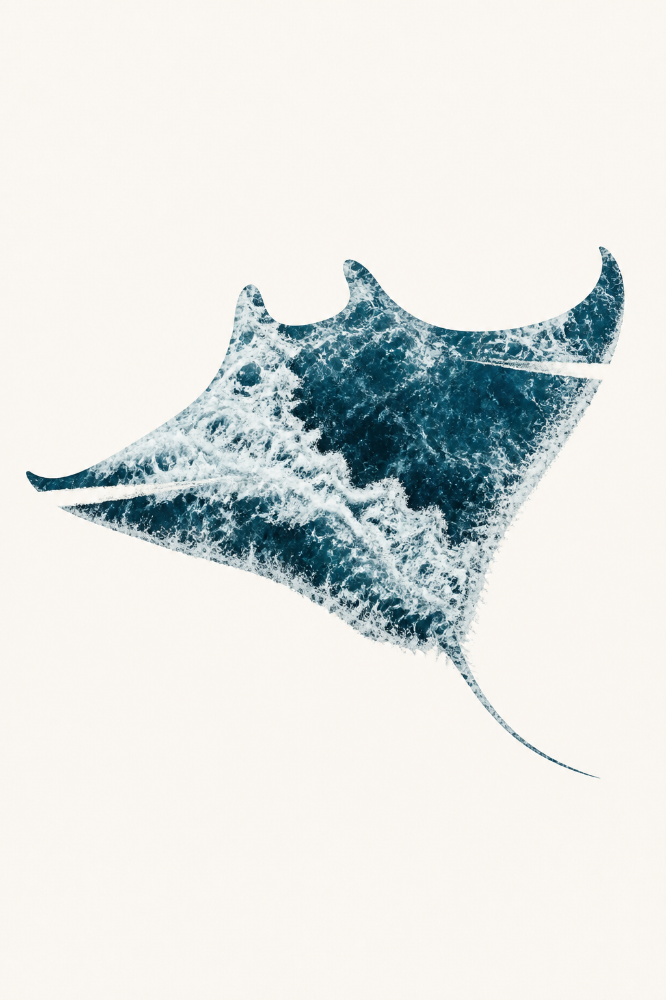
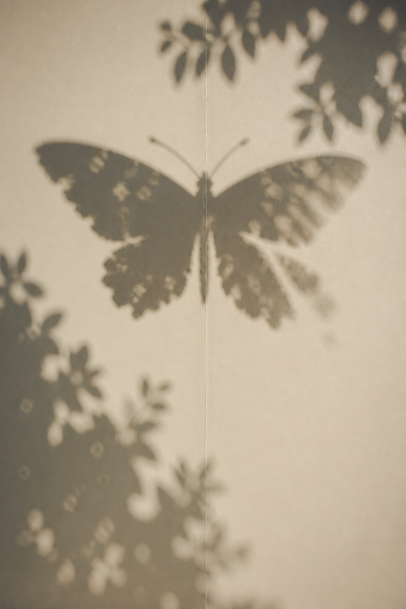
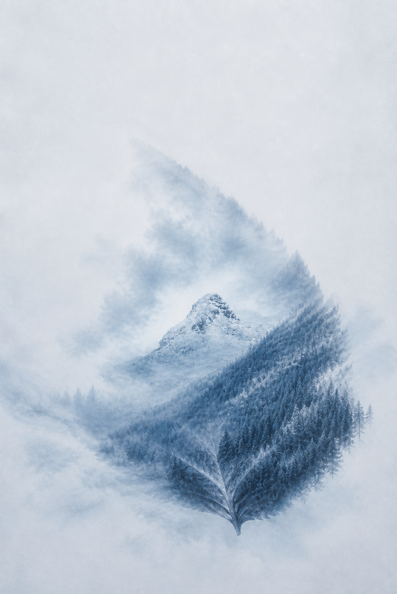

# Photo Form Transposition

Turn one photograph into a restrained visual-transposition poster: a new form becomes recognizable, while the original scene remains active through texture, light, rhythm, depth, and environmental continuity.

照片借形转译：不是套滤镜、描边、剪影蒙版或普通双重曝光，而是从一张照片中提炼结构，再让这些结构自然形成新的视觉形象。

## Examples

| Ocean to manta-like form | Tree shadow to moth | Mountain leaf with environment reconnection |
| --- | --- | --- |
|  |  |  |

The examples are development tests, not bundled generation references. See [THIRD_PARTY_NOTICES.md](THIRD_PARTY_NOTICES.md) for source-photo attribution.

## What the skill does

- extracts two to four dominant visual carriers from the uploaded photograph;
- compares several target forms instead of using fixed mappings such as `ocean = whale`;
- builds recognition from three or four source-derived anchors;
- reconnects the subject to the field through mist, shadow, light, water, grain, or other source material;
- supports subtle, balanced, and assertive transposition strengths;
- inspects the result for cutout, double-exposure, illustration, clutter, and forced-target failures.

The uploaded photograph remains the sole visual-content source by default.

## Install

Copy the installable folder into your Codex skills directory:

```text
photo-form-transposition/
├── SKILL.md
├── agents/openai.yaml
├── evals/evals.json
└── references/
```

On Windows, the usual destination is:

```text
%USERPROFILE%\.codex\skills\photo-form-transposition
```

On macOS or Linux, the usual destination is:

```text
~/.codex/skills/photo-form-transposition
```

## Use

Invoke it explicitly:

```text
Use $photo-form-transposition to turn my uploaded ocean photograph into a quiet editorial poster. Choose the target form from the image itself.
```

```text
使用 $photo-form-transposition，把这张树影照片转译成一个轮廓清晰但仍与墙面环境相连的视觉形象。
```

The skill expects an image-generation or image-editing capability that accepts a source image.

## Design principle

The target should feel reasonable without explanation. A balanced result keeps roughly 65–80% of the form readable, uses three or four recognition anchors, and lets two or three source-derived structures cross or dissolve the boundary. Environmental fusion is selective directional continuity, not a uniform opacity fade.

## License

The skill instructions and repository documentation are released under the [MIT License](LICENSE). Example-image source attribution is listed separately.

