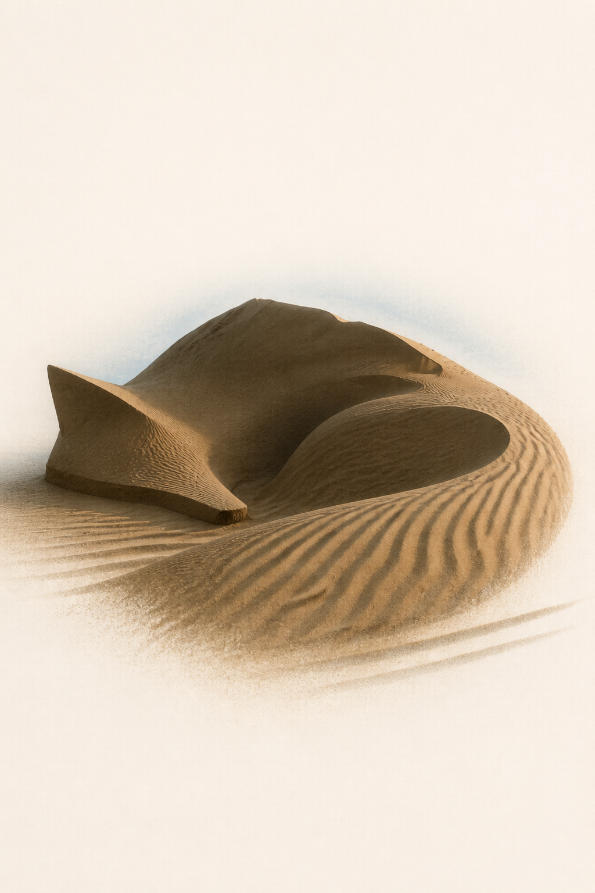
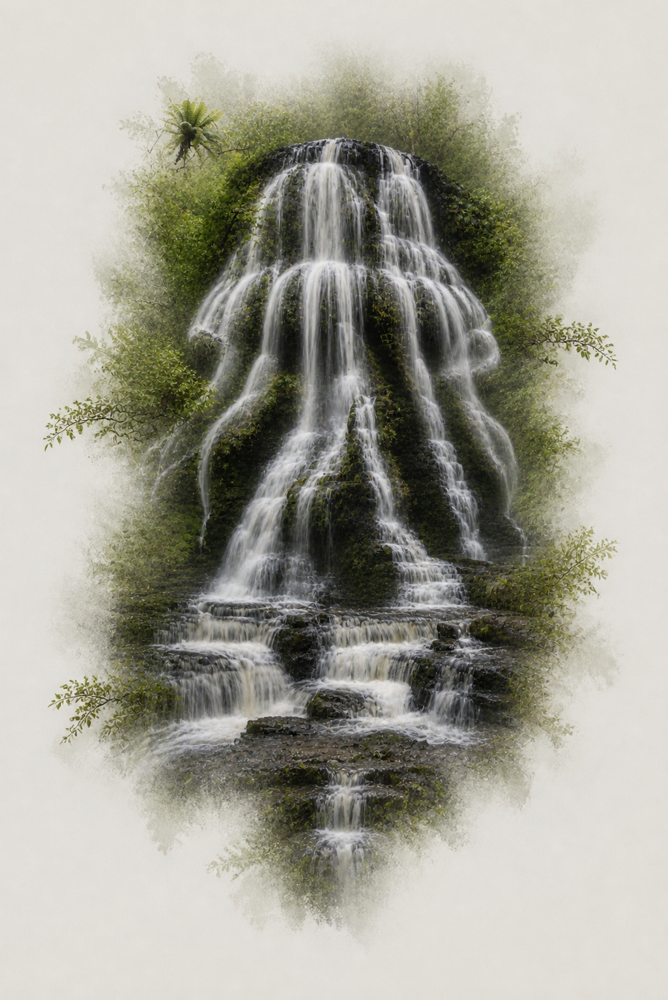
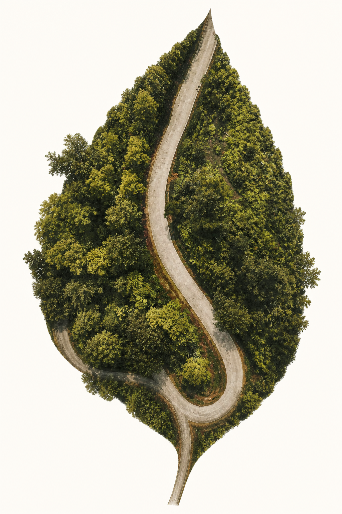
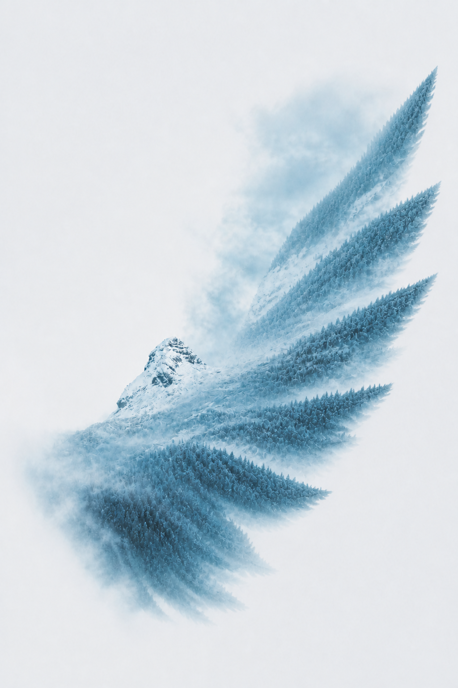

# Photo Form Transposition

Turn one photograph into a restrained visual-transposition poster: a new form becomes recognizable, while the original scene remains active through texture, light, rhythm, depth, and environmental continuity.

照片借形转译：不是套滤镜、描边、剪影蒙版或普通双重曝光，而是从一张照片中提炼结构，再让这些结构自然形成新的视觉形象。

## v1.1: source-led architectures

Version 1.1 first identifies what actually organizes the photograph:

- `mass-led` sources such as dunes, mountains, cloud banks, and large shadows;
- `flow-led` sources such as waterfalls, fog, branches, light, and smoke;
- `topology-led` sources such as roads, rivers, seams, wires, and paths;
- `hybrid` sources in which two carrier types are equally decisive.

It then selects a **keystone carrier** and maps the retained source regions to target roles before choosing one of three architectures: `contained`, `permeable`, or `gestural`. This keeps the target legible without assuming that every image needs an open or dissolving perimeter.

## Examples

| Mass-led: dunes to resting fox | Flow-led: waterfall to jellyfish |
| --- | --- |
|  |  |

| Topology-led: road to leaf | Hybrid: mountain panorama to wing |
| --- | --- |
|  |  |

The examples are development tests, not bundled generation references. See [THIRD_PARTY_NOTICES.md](THIRD_PARTY_NOTICES.md) for source-photo attribution.

## What the skill does

- classifies the photograph as mass-led, flow-led, topology-led, or hybrid;
- selects one keystone source feature to carry the target's main axis, hinge, sweep, or spine;
- compares several target forms through a carrier-to-form role map instead of fixed pairings such as `ocean = whale`;
- selects a contained, permeable, or gestural architecture according to the source;
- limits invented anatomy with a small completion budget;
- inspects the result with shared and architecture-specific quality gates.

The uploaded photograph remains the sole visual-content source by default.

## Install

Copy the installable folder into your Codex skills directory:

```text
photo-form-transposition/
├── SKILL.md
├── agents/openai.yaml
├── evals/evals.json
└── references/
```

On Windows, the usual destination is:

```text
%USERPROFILE%\.codex\skills\photo-form-transposition
```

On macOS or Linux, the usual destination is:

```text
~/.codex/skills/photo-form-transposition
```

## Use

Invoke it explicitly:

```text
Use $photo-form-transposition to turn my uploaded ocean photograph into a quiet editorial poster. Choose the target form from the image itself.
```

```text
使用 $photo-form-transposition，把这张树影照片转译成一个轮廓清晰但仍与墙面环境相连的视觉形象。
```

The skill expects an image-generation or image-editing capability that accepts a source image.

## Verify the package

Run the standard-library regression checks before publishing changes:

```powershell
python -m unittest discover -s tests -v
```

The checks validate the installable folder layout, Skill frontmatter, eval metadata, and local Markdown links.

## Design principle

The target should feel reasonable without explanation. Source structures must perform distinct target roles rather than merely filling a pre-drawn mask. Boundary behavior is architecture-specific: a contained result may keep a coherent perimeter, a permeable result preserves environmental continuity across it, and a gestural result lets one source motion dominate incomplete anatomy.

## License

The skill instructions and repository documentation are released under the [MIT License](LICENSE). Example-image source attribution is listed separately.
